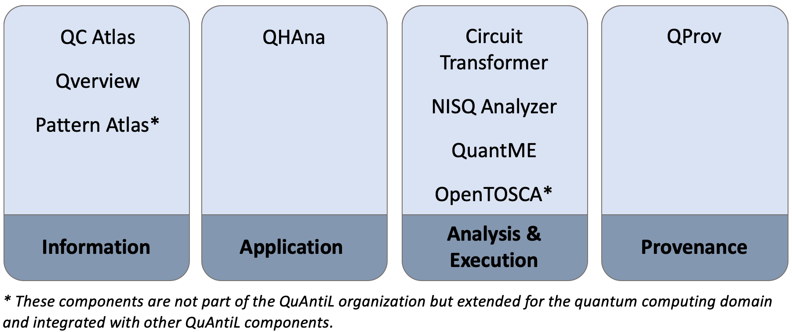

# Welcome to the QuAntiL Documentation!
{: style="height:100px" .center}
[Quantum Application Lifecycle Management (QuAntiL)](https://github.com/UST-QuAntiL) offers tooling support for various aspects of the quantum application lifecycle, such as implementation, deployment, execution, and monitoring of quantum applications, see the [website](https://www.iaas.uni-stuttgart.de/forschung/projekte/quantil/).

## Overview

### Information

[QC Atlas](./user-guide/qc-atlas.md) is a platform for sharing quantum software and is part of the project [PlanQK](https://planqk.de/en/).
Thereby, it enables the collection of quantum algorithms and their specific properties, such as input and output parameters, their problem descriptions and solutions.
Further, available implementations, related other algorithms, patterns, and publications of them can be added and linked.
But also the execution part is considered.
QC Atlas enables collecting information about existing software platforms, cloud services, and their offered compute resources, such as quantum computers or quantum simulators.

### Analysis & Execution
The [Circuit Transformer](./user-guide/circuit-transformer.md)

The [NISQ Analyzer](./user-guide/nisq-analyzer.md) enables the selection of suitable implementations and quantum computers (QPUs) dependent on given input data and the selected quantum algorithm.
Therefore, Prolog rules are defined to determine which input data can be processed by a specific implementation and to determine which QPU can successfully execute suitable implementations.
Thereby, quantum compilers are used to determine the width and depth of a compiled circuit on a specific QPU.
These properties are, then, compared with the number of qubits and the estimated maximum depth of the QPU to determine the executability.
To gain up-to-date information about available QPUs, the provenance system [QProv](./user-guide/qprov.md) is accessed.
In addition, the NISQ Analyzer enables the comparison of the width and depth of compiled quantum circuits dependent on the selected quantum computer and the initially given quantum circuit.

### Provenance
[QProv](./user-guide/qprov.md) is a provenance system for quantum computing. 
It periodically collects and analyzes important provenance attributes of accessible QPUs, such as the number of qubits, T1, T2, gate error rates, and current queue sizes.
Furthermore, it supports the calculation of calibration matrices of QPUs.
QProv builds the basis for, e.g., the NISQ Analyzer providing up-to-date information about accessible QPUs to support the selection of suitable QPUs.
It is, e.g., used by the [NISQ Analyzer](./nisq-analyzer.md) for the selection of suitable quantum implementations and QPUs and for the comparison of available quantum compilers.

## Integrated components of QC Atlas and the QC Atlas UI
The following diagram illustrates the currently integrated components of the QC Atlas platform and its UI:
