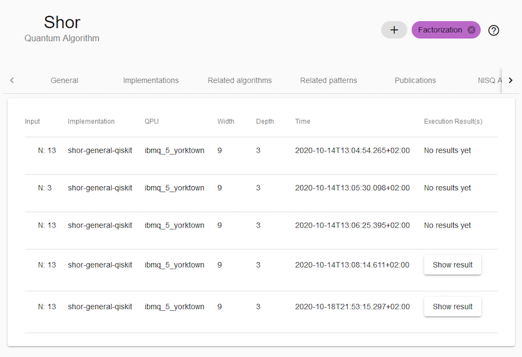

# NISQ Analyzer User Guide
The NISQ Analyzer is a research prototype based on the work by [Salm et. al](https://link.springer.com/chapter/10.1007/978-3-030-64846-6_5). It automatically analyzes implementations of quantum algorithms. The results indicate if a quantum algorithm can be executed on a Quantum Computing Unit (QPU) or simulator.

### SDKs, QPUs, and Cloud Services

Atlas' `Software Platforms` get mapped to SDKs. This mapping happens automatically when opening a Software Platform in the UI.   

QPUs are automatically retrieved by [QProv](https://github.com/UST-QuAntiL/qprov) a provenance system for quantum computing.   
 
`Cloud Services are required to run the *Implementation & QPU Selection*.  
Currently, only real quantum computers of the cloud service `IBMQ` are supported.

### Implementations

Implementations in Atlas are mapped to Implementations in the NISQ Analyzer DB.
Again, this mapping happens automatically when opening an Implementation in the UI.

Implementation properties specific to the NISQ Analyzer are inside the `Selection Criteria` tab.

Define the `File Location` as URL where the raw implementation is placed.

Select the previously added `Software Platform` and select the `Language` of the implementation. 

To add new input parameters press the `+` button on the right side of `Input Parameters`. Afterwards, insert the necessary data into the fields of the created Input Parameter.

To delete an Input Parameter, select the card on the left side and press the `-` button on the right, next to the heading `Input Parameters`.

Prolog Rules, e.g. `Selection Rule` can be changed as well. Make sure that the rules follow correct Prolog Syntax.

To save all changes press the round button on the right side.

!!! note 
    `Input Parameters` and `Selection Rule` are only required for the *Implementation & QPU Selection*.

### Prerequisites

* The cloud service `IBMQ` exists
* The software platform of the implementation exists
* The algorithm contains at least one implementation

## Running the NISQ Analyzer for Implementation & QPU Selection

The UI can be found at the `NISQ Analyzer` tab in the algorithm page.

### Step 1: Input

Specify the input values below the heading. Afterwards, select `IBMQ` in the dropdown menu and insert your Qiskit token for authentication purposes of the IBMQ service.

### Step 2: Analyzer Results

The table shows all results of the analysis process. Press the button `Execute` to run the selected QPU/implementation combination.

All analysis results are stored and can be viewed on the `NISQ Results` tab.

### Step 3: Execution Results

This step shows the result of the executed input/QPU/implementation tuple.
Keep in mind that the execution itself can take quite long time during in which the UI only shows a progress spinner.

All execution results are stored and can be reviewed on the `NISQ Results` tab.

## Historical data

Previous analysis and execution results can be found on the `NISQ Results` tab.

If the respective analysis result has been executed, the outcome of said execution can be viewed as well.

