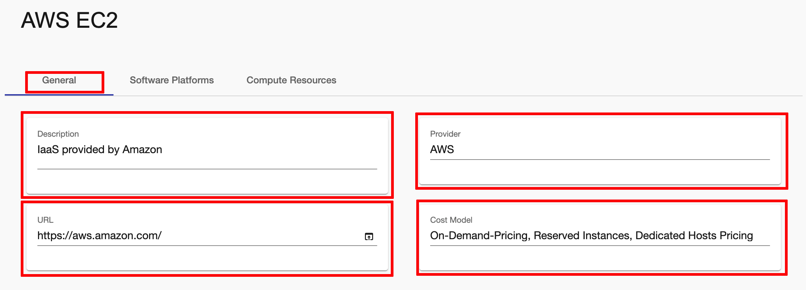
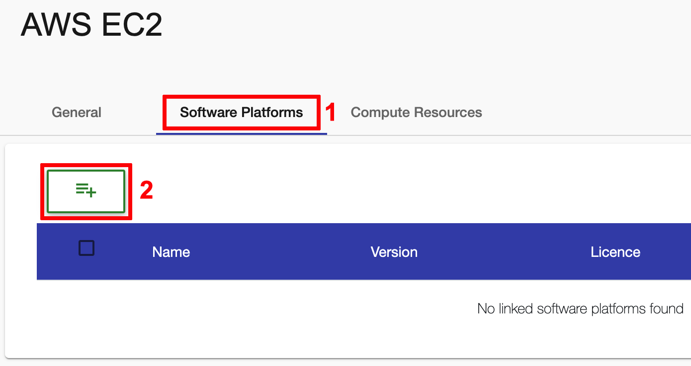
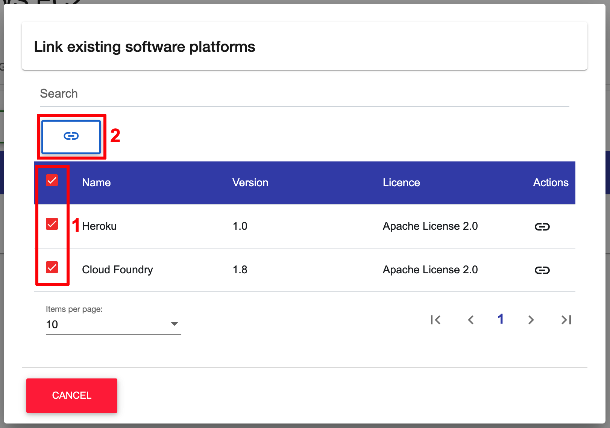
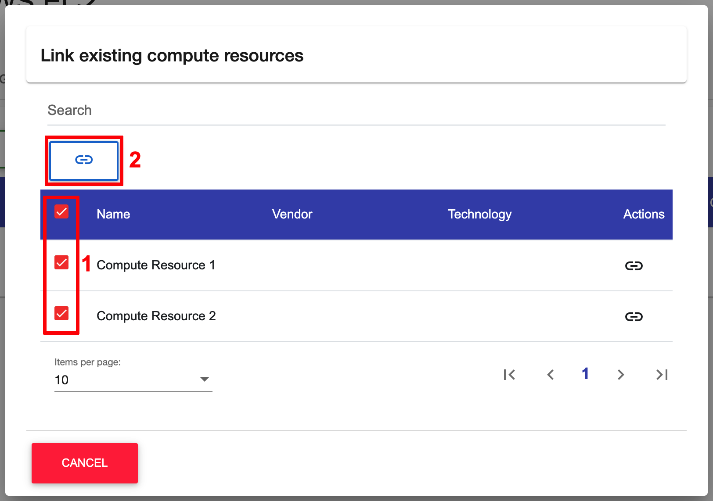
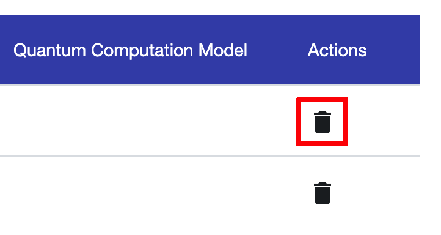

## Cloud Service 
### Create Cloud Service

To create a cloud service the user has to navigate to the ``Cloud Services List View`` by using the navigation sidebar. 
This will be done by first clicking on the ``Execution Environments Menu`` in the navigation sidebar, which makes the ``Cloud Services Sub-Menu`` visible.
The ``Cloud Service List View`` contains a data table of all available cloud services. Creating a new cloud service is done via the ``Plus Button`` which is located above the table.

Clicking on the ``Plus Button`` will open the following dialog.
In the dialog it is possible to give the new cloud service a name.

!!! note 
    To create a new cloud service only a ``name`` is required.

After all necessary fields have been filled in, the creation of the cloud service can be confirmed by clicking on the ``OK Button``. In case of a successful creation, the user will be navigated to the ``Cloud Service View`` of the new cloud service.

### Delete Cloud Service

!!! info 
    To perform the deletion of a cloud service, the user has to be in the ``Cloud Service List View``.
	
To remove a specific cloud service, the user has to simply click on the ``Delete Button`` in the ``Action Column`` of the data table.

It is also possible to delete multiple cloud services at once by selecting them one by one using the check-boxes within the table. When at least one cloud service is selected, a ``Master Delete Button`` will show up above the table, which allows the deletion of all selected cloud services.

Both ways of deleting cloud services will lead to a confirmation dialog. This dialog will list all the previously selected cloud services that will be deleted. To finally confirm the deletion, the ``OK Button`` at the bottom of the dialog has to be pressed. In case of a successful deletion, the deleted cloud services will disappear from the table.

### Update Cloud Service Information

!!! info 
    To update the information of a cloud service, the user has to be in the ``Cloud Service View`` which can be reached by clicking on a cloud service in the ``Cloud Service List View``.

Updating basic information is done in the ``General Tab`` of the ``Cloud Service View``. To do that, the user has to simply use the ``Input fields``, ``Check-Boxes`` or ``Selection drop-downs`` to add new values or adjust existing ones.

If information is changed, a ``Save Button`` will be displayed next that specific input field. Also, a ``Master Save Button`` will appear at the right side of the screen. To save the changes of each input field individually, the user can click on the ``Save Button`` next to any updated input field. Alternatively the user can save all changes by clicking the ``Master Save Button``.

!!! note 
    The user can also hit ``Enter`` on the keyboard to save the changes of a single field in most cases. In some cases, it may be necessary to focus the ``Save Button`` by hitting ``TAB`` on the keyboard and then confirming with ``Enter``.

### Reference Software Platform

!!! info
    To reference software platforms in an existing cloud service, the user has to be in the ``Software Platforms Tab`` of the ``Cloud Service View``, which can be reached by clicking on a cloud service in the ``Cloud Service List View``.

In the ``Cloud Service View``, the user as to switch to the``Software Platforms Tab``, which is dedicated to referencing software platforms.
To link software platform with the currently selected cloud service, the user has to click on the ``Plus Button`` at the top of the data table.

This will open a dialog with a separate data table containing existing software platforms.
This table can be searched or sorted using the given input fields.
For referencing software platforms the user has to click on the ``Link Button`` of the software platform he wants to reference.

Alternatively, the users can use the check-boxes to select all software platforms he wants to reference. 
If it least one software platform is selected a ``Master Link Button`` will appear at the top of the table, which can be used to link all selected software platforms with the cloud service.

### Dereference Software Platform

!!! info 
    To dereference software platforms, the user has to be in the ``Software Platforms Tab`` of the ``Cloud Service View``, which can be reached by clicking on a cloud service in the ``Cloud Service List View``.
	
To remove the reference to a software platform, the user has to simply click on the ``Delete Button`` in the ``Actions Column`` of the data table.

Alternatively use the check-boxes to select multiple software platforms and then click on the ``Master Delete Button`` to unlink multiple software platforms at once.

!!! note 
    ``Master Delete Button`` will only appear if at least one software platform is selected.
	

### Reference Compute Resource

!!! info
    To reference compute resource in an existing cloud service, the user has to be in the ``Compute Resource Tab`` of the ``Cloud Service View``, which can be reached by clicking on a cloud service in the ``Cloud Service List View``.

In the ``Cloud Service View``, the user as to switch to the ``Compute Resource Tab``, which is dedicated to referencing compute resources.
To link a compute resource with the currently selected cloud service, the user has to click on the ``Plus Button`` at the top of the data table.

This will open a dialog with a separate data table containing existing compute resources.
The table can be searched or sorted using the given input fields and control buttons.
For referencing a compute resource, the user has to click on it's ``Link Button``.

Alternatively, the user can use the check-boxes to select multiple compute resources he wants to reference. 
It at least one compute resource is selected, a ``Master Link Button`` will appear at the top of the table which can be used to link all selected compute resources at once.

### Dereference Compute Resource

!!! info 
    To dereference compute resources, the user has to be in the ``Compute Resource Tab`` of the ``Cloud Service View``, which can be reached by clicking on a cloud service in the ``Cloud Service List View``.
	
To remove a existing reference to a compute resource, the user has to simply click on the ``Delete Button`` in the ``Actions Column`` of the data table.

Alternatively use the check-boxes to select multiple compute resources and then click on the ``Master Delete Button`` to unlink multiple compute resources at once.

!!! note 
    ``Master Delete Button`` will only appear if at least one compute resource has been selected.
	
