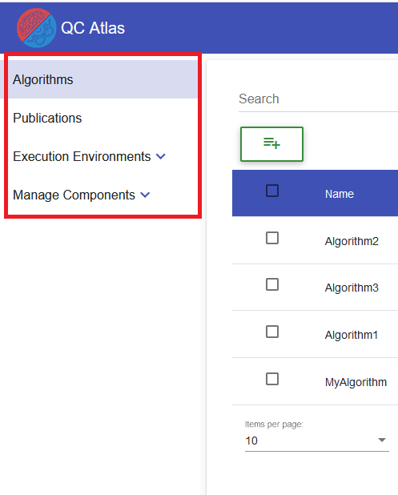
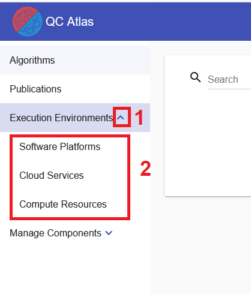
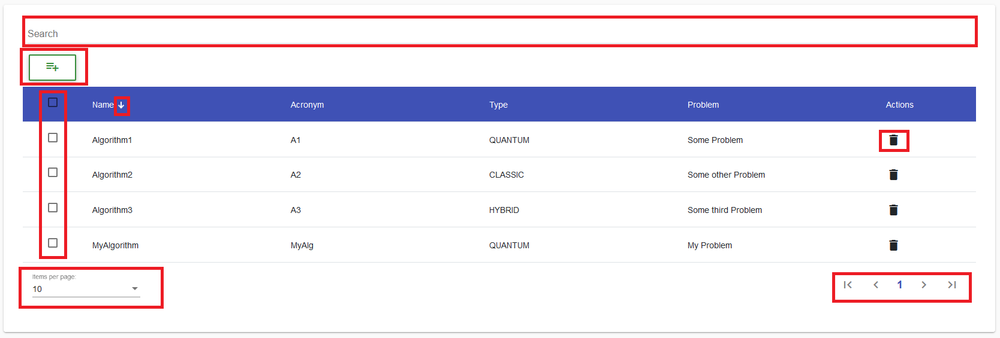
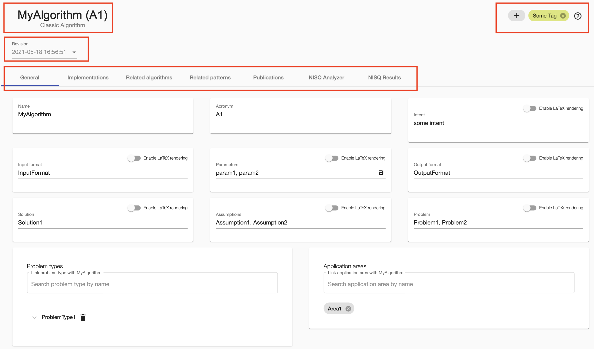

## General Information about UI-Components
The [UI](https://github.com/UST-QuAntiL/qc-atlas-ui)  of the QC Atlas is built using ``List Views`` and ``Object Views``.

### List View
``List Views`` can be reached by using the ``Navigation Bar`` on the left side of the UI. 

Some ``List Views`` like the ``Execution Environments`` can contain more ``List Views``. ``Navigation Bar`` items that contain more ``List Views`` have a ``Arrow Symbol`` and can be extended by a simple click.

The ``List Views`` contain ``Data-Tables`` which are responsible for displaying all available objects of a certain type. For every different object type there is a separate ``List View``. The user can use the controls of the tables to **filter**, **sort** and **browse** existing objects of a certain type.

!!! note
    * To filter the displayed objects, the user can use the ``Search Field`` to filter objects by their names, titles or other criteria.
	* To sort the displayed objects, the user can click on the header of a certain column. A ``Arrow Symbol`` will appear that will indicate how the data is currently sorted (ASC/DESC).
	* To browse the objects, the user can switch and configure the pages of the ``Data Table`` by using the ``Pagination Controls`` which are located at the footer of the table. The user can either change the amount of displayed elements per page or change pages.
	
	Note that all of these functionalities are optional and may not be available in every ``List View``

!!! info
    The ``Data Table`` can also contain more means to manipulate the data:
	
    * A ``Create Button`` or ``Reference/Link Button`` may be at the top of the ``Data Table``, allowing the users to add new elements to the ``List View``. 
	* In the ``Actions Column`` of the ``Data Table`` more buttons may be located allowing the user to ``Edit`` or ``Delete/Dereference`` existing objects and remove them from the ``List View``.
	* The first column of the ``Data Table`` may contain check-boxes which allow the user to select one or more elements of the current page of the ``Data Table`` to perform specific actions on multiple elements. One example would the the ability to ``Delete`` or ``Dereference`` multiple elements at once.
	
	In some cases, the elements of a ``Data Table`` are also click-able. Then, the ``Mouse Cursor`` will change to a ``Pointer``. If some element is clicked, the user will be redirected to that element's ``Object View``.
	
	
### Object View
As mentioned before, any ``Object View`` can be opened by clicking on any element of a ``List View``. In the ``Header`` of any ``Object View``, it's ``Name`` is displayed, as well as it's optional ``Tags``.

All other information about the object is located in the ``Body`` of the ``Object View``. The information is distributed across multiple ``Tabs``. The ``General Tab`` usually contains the most basic information about the object. Other information is distributed across the other ``Tabs``, which can differ from ``Object View`` to ``Object View``.

!!! info
    The ``Object View`` is not only used to display information about an object. It is also used to:
	
    * ``Update`` all kinds of information of that object
	* ``Reference`` or ``Dereference`` other objects
	* And more...