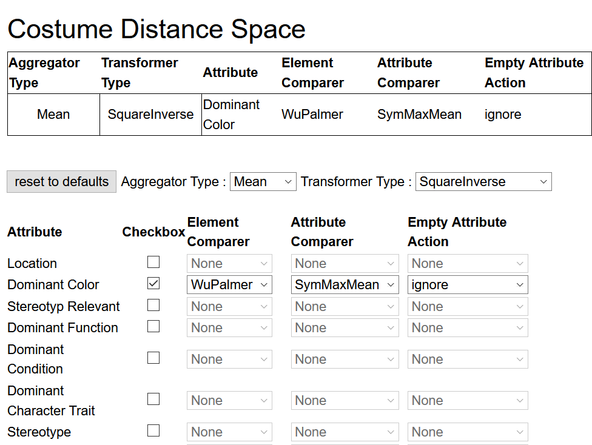
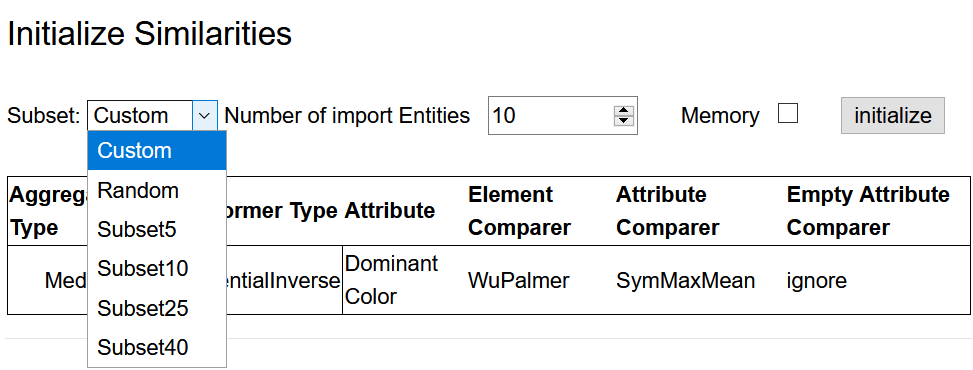
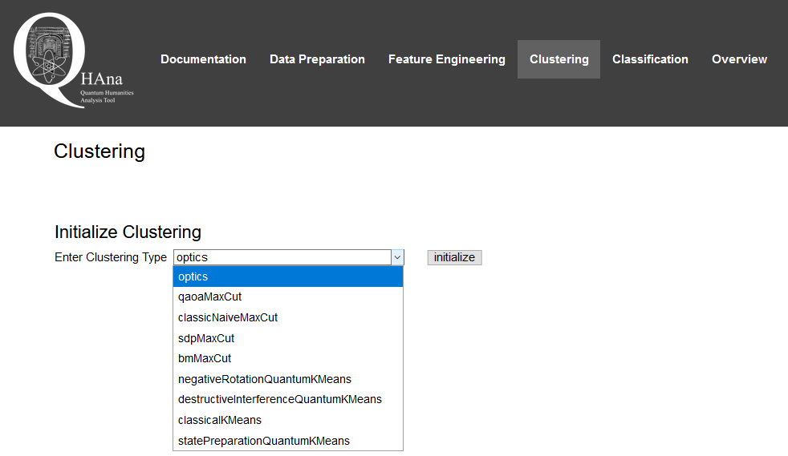

# QHAna User Guide

[QHAna](https://github.com/UST-QuAntiL/qhana) - The **Q**uantum **H**umanities **Ana**lysis Tool is a toolset of Machine Learning techniques for classical and quantum hardware, designed for the use with the [MUSE Repository](https://www.iaas.uni-stuttgart.de/publications/INBOOK-2018-05-MUSE.pdf). It comprises a rich set of techniques, mostly for categorical data. The tools are split up into 4 different categories: **Data Preparation, Feature Engineering, Clustering,** and **Classification**.

From each category various alternative methods can be selected to be used for the analysis. Currently, the toolset will assume and apply one of the following data flows depending on whether tools of the respective categories were initialized:

1. Data Preparation &#8594; Feature Engineering
2. Data Preparation &#8594; Feature Engineering &#8594; Clustering
3. Data Preparation &#8594; Feature Engineering &#8594; Classification
4. Data Preparation &#8594; Feature Engineering &#8594; Clustering &#8594; Classification

I.e., Data Preparation and Feature Engineering are mandatory to run an analysis.

## Setting up an Analysis

### Data Preparation

In order to use the machine learning techniques, one needs to convert categorical data into a numerical representation. This is done in the Data Preparation step. Go to `Data Preparation` in the navigation bar to select a Data Preparation method. `One-Hot-Encoding` is not yet implemented. Thus, select `Distance Space Computation`.

`Costumes` is pre-selected since it's the only repository available in this prototype. Click on `Definition` to choose which attributes from the repository shall be included in the data preparation. A list of attributes similar to the figure below will appear. Tick the attributes that shall be fetched from the repository. For each attribute that shall be included into the computations, select an `Element Comparer`, an `Attribute Comparer`, and an `Empty Attribute Action` from the respective dropdown list.

An `Aggregator Type` and `Transformer Type` can be selected via the dropdown lists above the attribute list.

After finishing the definition of the distance space, go back to `Distance Space Computation` via the navigation bar and click on `Similarities` to select the data set to be loaded from the repository. There are four pre-defined subsets of the data available (see figure below). The size of these subsets is indicated in their names. Alternatively, a random sample of entities can be loaded. Select one of the subsets or a random sample of preferred size and click `initialize`.

The setup of the Data Preparation step is now complete.

### Feature Engineering

Once a numerical representation (mostly similarities or dissimilarities) has been found for the categorical data, the next step is to map those values to metrices in order to get real distances. Moreover, as in most cases the data consist of multiple properties, i.e., living in a high dimensional computation space, it is necessary to apply a dimensionality reduction scheme.

Go to `Feature Engineering` in the navigation bar. Since the `Autoencoder` and `Principle Component Analysis (PCA)` are not yet implemented, click on `Embedding`.

Click `initialize` to initialize the `Multidimensional Scaling (MDS)`.
Change the parameters for the `MDS` (not shown) as desired and click `set parameters` (optional in case nothing was changed).
By default `MDS` will reduce the data to two dimensions.

!!! note
	`MDS` by default is not deterministic. I.e., the `Feature Engineering` step may produce different results in each run on the same similarity matrix. Set the `Static Eulidean Coordinates` checkbox in the `MDS` parameter list if this is not desired. This way the previous `Euclidean Coordinates` will be reused for the same similarity matrix and thus the same output will be produced in each run.

### Clustering

!!! note
	Setting up `Clustering` is optional.

Having real distances between data points allows the usage of well known (and experimental) clustering algorithms. Via the navigation bar go to the `Clustering` menu. Select one of the available clustering algorithms and click `initialize`. Change parameters as desired or use the default values.

### Classification

!!! note
	Setting up `Classification` is optional.

Via the navigation bar go to `Classification`. There are three submenus available.

#### Data Labeler

Since classification is supervised learning it requires labelled data. In the `Data Labeler` submenu, there are three labeling strategies available (brief explanation follows below the figure).

1. **Fixed subset**: The pre-defined subsets were categorized manually into two classes. This labeler uses labels based on that categorization.
2. **Attribute**: This labeler can be used to assign labels to data points based on an attribute. **Important**: The attribute needs to be included in the fetched data (see `Data Preparation` step). I.e., at least the checkbox for the respective attribute needs to be set. It is not necessary to include the attribute in computations by setting Element and Attribute Comparers.
3. **Clustering**: This strategy takes the labels produced in the clustering step in the same run. This requires that a clustering method is initialized.

#### Data Splitter

Typically for supervised learning one needs to assess the success of the learning to detect problems, such as overfitting. This is done by splitting the data into two parts: a training set and a test set. The classifier will be trained only on the training set. After training, the test set is used to determine how accurate the classifier is.
`Initialize` one of the four splitting strategies in the `Data Splitter` submenu and set its parameters if applicable.

#### Classifier

In the `Classifier` submenu, select and `initialize` one of the available classification algorithms and change its parameters as desired.

## Running the Analysis

In order to run the configured analysis go to `Overview` in the navigation bar and click on `Calculating`. There will be a summary of the setup. At the top click `Start calculating` to start the calculations. This may take some time depending on the selected algorithms. Once calculations are complete, the application forwards to the `Result` page.

## Result

The `Result` page shows diagrams of the results of each step that was set up.

