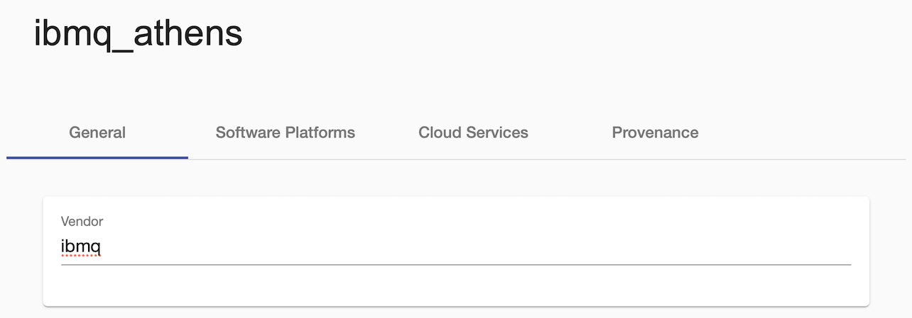
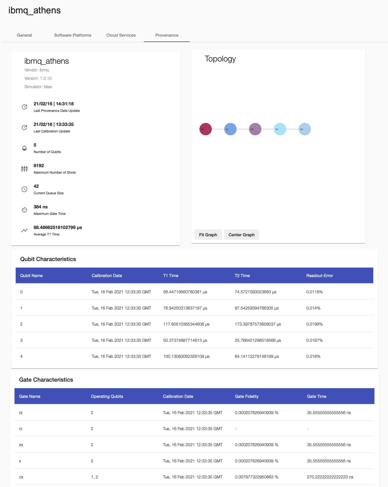

# QProv User Guide

[QProv](https://github.com/UST-QuAntiL/qprov) is a provenance system for quantum computing. It enables the collection and analysis of important provenance attributes about QPUs. It is, e.g., used by the [NISQ Analyzer](./nisq-analyzer.md) for the selection of suitable quantum implementations and QPUs and for the comparison of available quantum compilers.

## Retrieve Provenance Data of a QPU

To retrieve provenance data of a certain QPU, first set your IBMQ token at the `QPROV_IBMQ_TOKEN` field and check if `QPROV_IBMQ_AUTO_COLLECT` is set to **true** in the [docker-compose](../developer-guide/docker.md).

!!! note 
    Currently, only quantum computers of `IBMQ` are supported, thus, in this case, your IBMQ token is required.

Then, add the QPU to the list of `Compute Resources` under `Execution Environments`, and define the required QPU name, see [Compute Resource](./execution-environments/compute-ressource.md). Then, specify its `Vendor` under the `General` tab and click the save button.

Refresh the page and open the `Provenance` tab.  
A great set of provenance data about the topology, metadata, qubits, and quantum gates is displayed.

## Calculating the Calibration matrix of a QPU

For calculating the calibration matrices for given QPUs, set `QPROV_IBMQ_EXECUTE_CIRCUITS` to **true**.